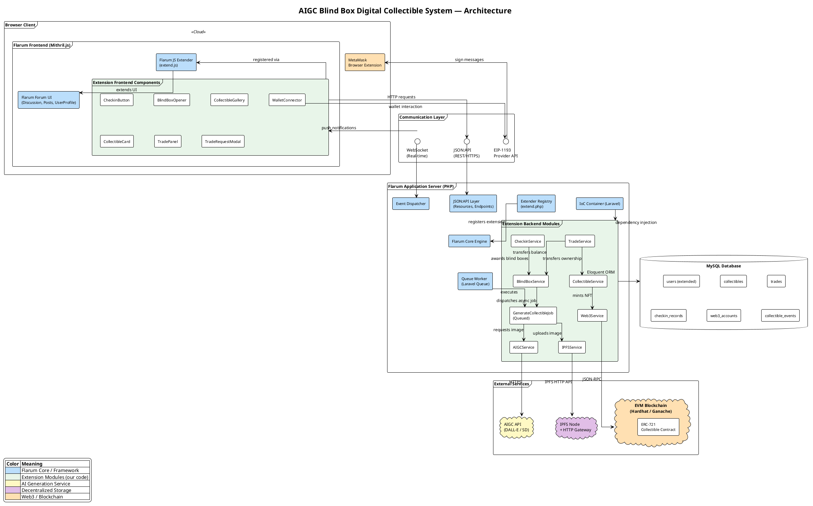
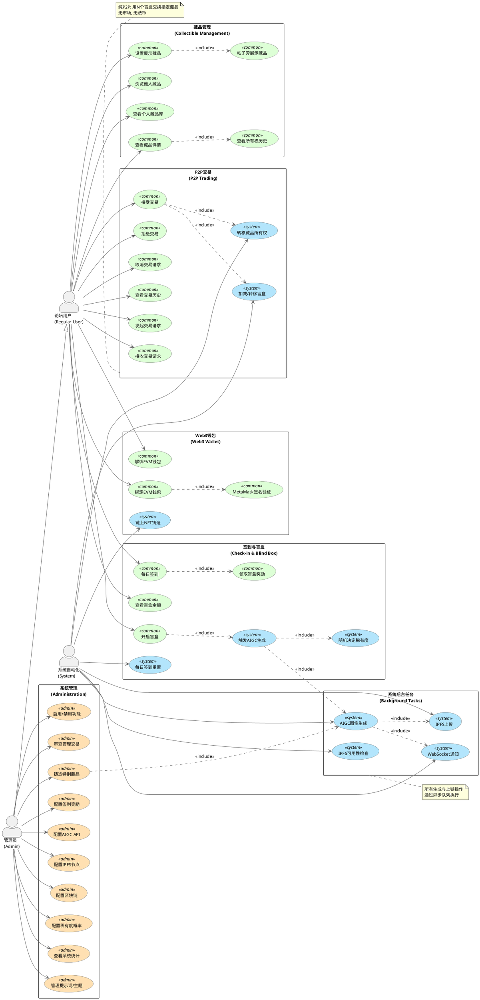
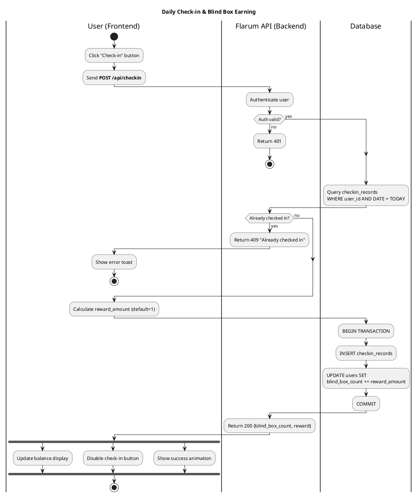
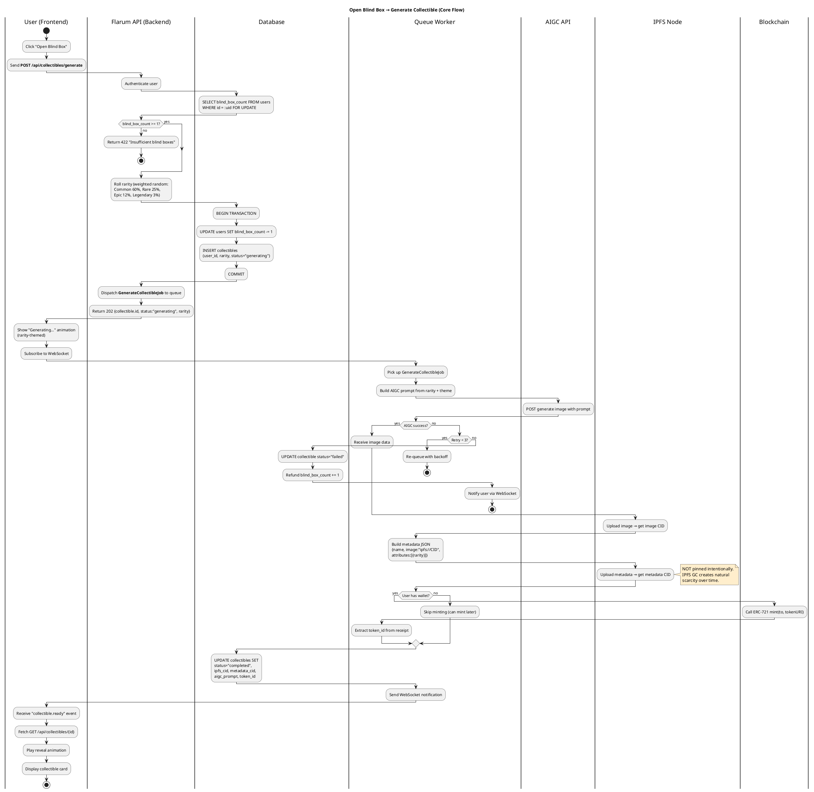
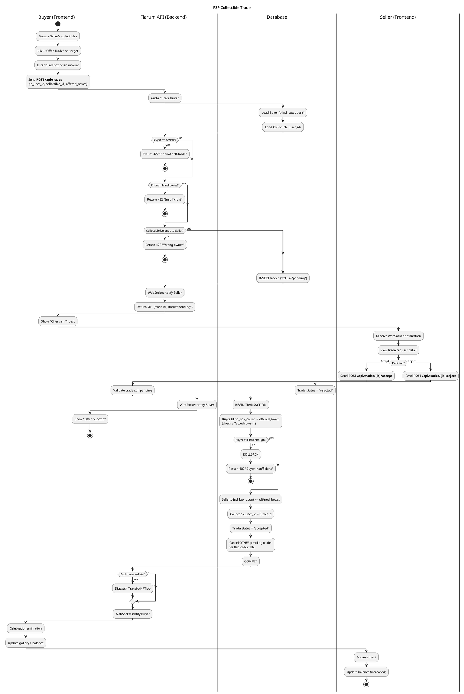
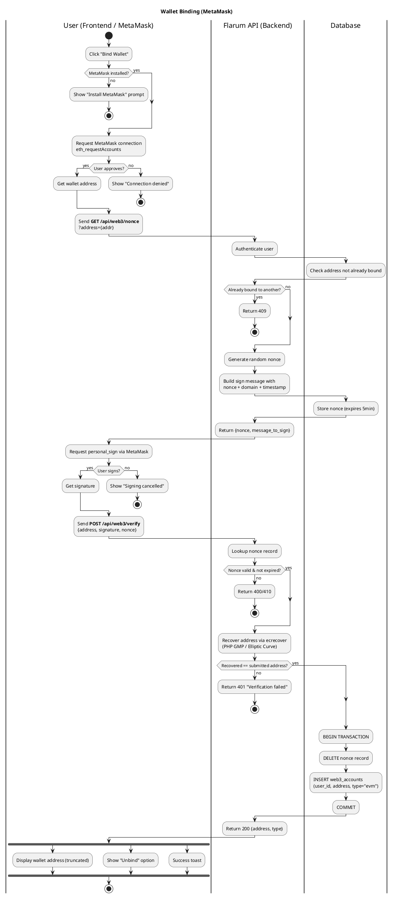
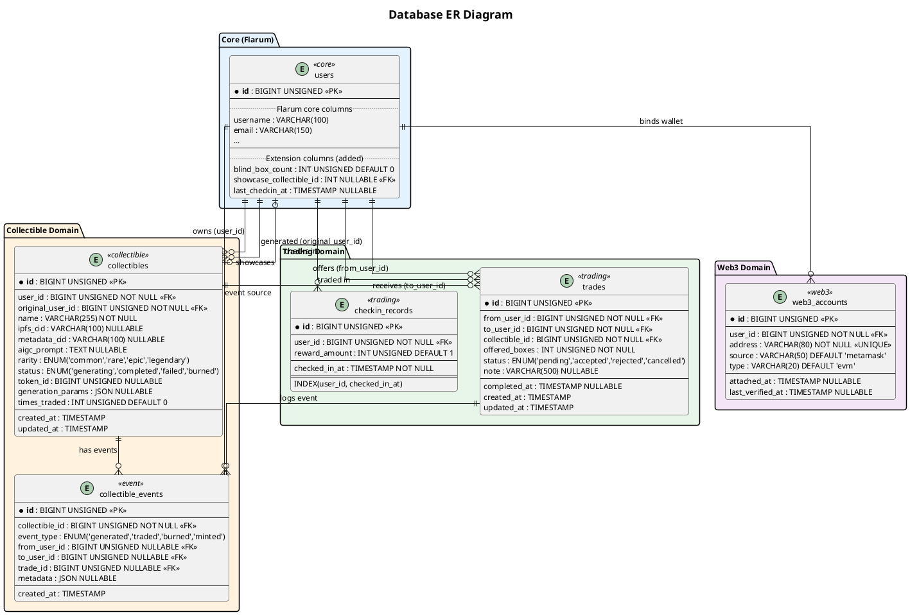

# AIGC Blind Box Digital Collectible Generation & Circulation System

> A Flarum forum extension (`donk/flarum-ext-aigc-collectibles`) that integrates daily check-in, AIGC-powered blind box collectible generation, IPFS storage, P2P trading, and optional ERC-721 NFT minting.

## Project Identity

- **Extension ID**: `donk-aigc-collectibles`
- **Namespace**: `Donk\AigcCollectibles`
- **Frontend entry**: `js/src/forum.ts`, `js/src/admin.ts`
- **Backend entry**: `extend.php`
- **Flarum version**: 2.0+
- **PHP**: ^8.2
- **License**: MIT

## Core Concepts

| Concept                  | Description                                                                                                                                                              |
| ------------------------ | ------------------------------------------------------------------------------------------------------------------------------------------------------------------------ |
| **Blind Box (盲盒)**     | Virtual currency earned via daily check-in. Spent to generate collectibles. Also used as trading currency in P2P exchanges.                                              |
| **Collectible (藏品)**   | AIGC-generated digital artwork. Stored on IPFS. Displayed next to user posts. Has rarity level. Optionally minted as ERC-721 NFT.                                        |
| **Rarity (稀有度)**      | Common (60%), Rare (25%), Epic (12%), Legendary (3%). Determined by weighted random roll on generation.                                                                  |
| **Trade (交易)**         | P2P exchange: Buyer offers N blind boxes for Seller's specific collectible. No marketplace, no fiat currency.                                                            |
| **Showcase (展示)**      | Each user can select one collectible to display beside their posts (like an enhanced badge/avatar frame).                                                                |
| **IPFS without Pinning** | Images uploaded to IPFS but intentionally NOT pinned. Unpopular collectibles may naturally "disappear" over time via IPFS garbage collection, creating organic scarcity. |

## Tech Stack

| Layer         | Technology                                                            |
| ------------- | --------------------------------------------------------------------- |
| Forum Engine  | Flarum 2.0+ (PHP, Laravel 12 components)                              |
| Backend ORM   | Eloquent (Active Record pattern via `Flarum\Database\AbstractModel`)  |
| API Protocol  | JSON:API (via Flarum Resources + Endpoints, based on tobyz/json-api-server) |
| Frontend      | Mithril.js (Flarum's built-in frontend framework)                     |
| Database      | MySQL                                                                 |
| AIGC          | External API (DALL-E / Stable Diffusion / compatible service)         |
| Image Storage | IPFS (Pinata API or self-hosted node, HTTP Gateway)                   |
| Blockchain    | Local EVM chain (Hardhat/Ganache for dev), ERC-721 smart contract     |
| Real-time     | WebSocket (for trade notifications, generation completion)            |
| Queue         | Laravel Queue (for async AIGC generation + IPFS upload + NFT minting) |
| Wallet        | MetaMask (EVM only, no Dotsama/Substrate support)                     |

---

## Architecture Diagram (系统架构图)



---

## Use Case Diagram (按角色拆分用例图)



---

## System Module Division (系统模块划分示意图)

```plantuml
@startuml Module_Division
!theme plain
skinparam packageStyle frame
skinparam linetype ortho
skinparam nodesep 40
skinparam ranksep 35
skinparam defaultFontSize 11
skinparam packageFontSize 13

title Module Division — Extension Internal Structure

package "Entry Points" as entry #E3F2FD {
    class "extend.php" as extend_php <<Backend>> {
        Frontend, Routes, Model
        ApiSerializer, ServiceProvider
        Event subscriber, Console
    }
    class "extend.js" as extend_js <<Frontend>> {
        app.initializers
        extend(PostUser)
        extend(UserPage)
    }
}

package "Backend (PHP)" as backend #E8F5E9 {

    package "Access" as access #C8E6C9 {
        class "CollectiblePolicy"
        class "TradePolicy"
        class "CheckinPolicy"
    }

    package "Api" as api #C8E6C9 {
        package "Resource" {
            class "CollectibleResource" { type: "collectibles" }
            class "TradeResource" { type: "trades" }
            class "CheckinRecordResource" { type: "checkin-records" }
            class "Web3AccountResource" { type: "web3-accounts" }
            class "CollectibleEventResource" { type: "collectible-events" }
        }
    }

    package "Command (CQRS)" as command #C8E6C9 {
        class "Checkin + Handler"
        class "OpenBlindBox + Handler"
        class "CreateTrade + Handler"
        class "AcceptTrade + Handler"
        class "CancelTrade + Handler"
        class "BindWallet + Handler"
        class "MintCollectible + Handler"
    }

    package "Event" as event #C8E6C9 {
        class "CheckedIn"
        class "BlindBoxOpened"
        class "CollectibleGenerated"
        class "TradeCreated"
        class "TradeCompleted"
        class "WalletBound"
        class "CollectibleMinted"
    }

    package "Job (Queue)" as job #C8E6C9 {
        class "GenerateCollectibleJob" {
            handle(AIGCService, IPFSService)
        }
    }

    package "Model" as model #C8E6C9 {
        class "Collectible" { rarity, ipfs_cid, token_id }
        class "Trade" { status, offered_boxes }
        class "CheckinRecord" { checked_in_at }
        class "Web3Account" { address, type }
        class "CollectibleEvent" { event_type }
    }

    package "Repository" as repository #C8E6C9 {
        class "CollectibleRepository"
        class "TradeRepository"
        class "CheckinRepository"
    }

    package "Service" as service #C8E6C9 {
        class "AIGCService" { generateImage(prompt) }
        class "IPFSService" { upload(data): CID }
        class "BlockchainService" { mintNFT(), verifySignature() }
        class "CheckinService" { performCheckin(user) }
        class "BlindBoxService" { award(), spend(), balanceOf() }
        class "TradeService" { createOffer(), acceptTrade() }
    }

    package "Validator" as validator #C8E6C9 {
        class "TradeValidator"
        class "Web3LoginValidator"
        class "CheckinValidator"
    }

    package "Provider" as provider #C8E6C9 {
        class "CollectibleServiceProvider" {
            register(), boot()
        }
    }

    package "Migration" as migration #C8E6C9 {
        class "create_collectibles_table"
        class "create_trades_table"
        class "create_checkin_records_table"
        class "create_web3_accounts_table"
        class "create_collectible_events_table"
        class "add_blindbox_fields_to_users"
    }
}

package "Frontend (Mithril.js / TS)" as frontend #FFF3E0 {
    package "components" #FFE0B2 {
        class "CheckinButton"
        class "BlindBoxOpener"
        class "CollectibleCard"
        class "CollectibleGallery"
        class "TradePanel"
        class "TradeRequestModal"
        class "WalletConnector"
        class "PostCollectibleBadge"
    }
    package "models" #FFE0B2 {
        class "Collectible" as fm_col
        class "Trade" as fm_trade
        class "CheckinRecord" as fm_checkin
    }
    package "utils" #FFE0B2 {
        class "web3" { connectWallet(), signMessage() }
        class "ipfs" { gatewayUrl(cid) }
        class "notifications" { wsConnect() }
    }
}

extend_php -down-> provider : registers
extend_php -down-> api : defines routes
extend_php -down-> migration : runs
extend_js -down-> frontend : registers

legend bottom left
  |= Color |= Layer |
  | <#E3F2FD> | Entry Points |
  | <#C8E6C9> | Backend PHP |
  | <#FFE0B2> | Frontend TS |
endlegend

@enduml
```

---

## Core Business Flow: Daily Check-in (每日签到)



---

## Core Business Flow: Open Blind Box (开启盲盒 — 核心流程)



---

## Core Business Flow: P2P Trade (P2P藏品交易)



---

## Core Business Flow: Wallet Binding (钱包绑定)



---

## Database ER Diagram (数据库 ER 图)



---

## Flarum Extension Conventions & Patterns

### Backend Architecture Patterns

**Extender System**: All backend registration goes through `extend.php`. Key extenders:

- `Extend\Frontend('forum')` — register JS/CSS assets
- `Extend\ApiResource(CollectibleResource::class)` — register a new Resource (auto-registers routes)
- `Extend\ApiResource(UserResource::class)->fields(...)` — add fields to an existing Resource
- `Extend\Model(User::class)` — add casts, defaults, relationships to existing models
- `Extend\Routes('api')` — register custom non-Resource routes (rarely needed)
- `Extend\ServiceProvider` — register services into IoC container
- `Extend\Event` — subscribe to domain events

**Resource Layer** (Flarum 2.x JSON:API):

- Each API entity is a Resource class extending `Flarum\Api\Resource\AbstractDatabaseResource`
- A single Resource replaces the old Controller + Serializer pair
- Resources define: `type()`, `model()`, `endpoints()`, `fields()`, `sorts()`, `scope()`
- Endpoints: `Endpoint\Index`, `Endpoint\Show`, `Endpoint\Create`, `Endpoint\Update`, `Endpoint\Delete`, `Endpoint\Endpoint` (custom)
- Fields: `Schema\Str`, `Schema\Integer`, `Schema\Boolean`, `Schema\DateTime`, `Schema\Arr`
- Relationships: `Schema\Relationship\ToOne`, `Schema\Relationship\ToMany`
- Routes are auto-registered based on `type()` — e.g. type `'collectibles'` → `/api/collectibles`
- Lifecycle hooks: `creating()`, `updating()`, `deleting()`, `saving()`, `saved()`, etc.

**Model Layer** (Eloquent Active Record):

- All models extend `Flarum\Database\AbstractModel` (which extends `Illuminate\Database\Eloquent\Model`)
- One class = one table, one instance = one row, properties = columns
- Relationships: `hasOne`, `belongsTo`, `hasMany`, `belongsToMany`
- Use `Migration::createTable()` helper (returns `['up' => fn, 'down' => fn]` array)
- Migration naming: `YYYY_MM_DD_HHMMSS_snake_case_description.php`

**CQRS Command Pattern**: Resource endpoint actions dispatch Command objects, Handler classes process them. This decouples API handling from business logic.

**JSON:API Protocol**: All API responses follow strict JSON:API spec via `tobyz/json-api-server`. Resources define field schemas that automatically serialize models. Frontend uses `app.store` to cache and access model instances.

### Frontend Architecture Patterns

**Mithril.js Components**: Extend existing Flarum components via `extend()` utility:

```js
import { extend } from "flarum/common/extend";
import PostUser from "flarum/forum/components/PostUser";
```

**Frontend Models**: Extend `flarum/common/Model`, register with `Extend.Store().add('collectibles', Collectible)` in `extend.js`.

**Path Aliases**: `'flarum/common/...'` paths are Webpack aliases to Flarum core globals, NOT physical node_modules paths.

### Key Technical Decisions

1. **EVM only** — No Dotsama/Substrate support. MetaMask + GMP for signature verification (no Rust FFI needed).
2. **IPFS without pinning** — Intentional design: creates natural scarcity via IPFS garbage collection.
3. **Async generation** — AIGC + IPFS + minting all happen in queue jobs, not in the HTTP request cycle.
4. **Blind box as currency** — No fiat currency, no marketplace. Pure P2P barter with blind boxes as the medium of exchange.
5. **Optional NFT minting** — Collectibles exist in MySQL first. On-chain minting only happens if user has bound wallet. Can be done retroactively.
6. **DB transaction safety** — All balance transfers and ownership changes wrapped in DB transactions with row-level locking (`FOR UPDATE`).
7. **WebSocket notifications** — Real-time push for trade requests, generation completion, trade outcomes.

### NFT Data Architecture (Three-Layer Model)

| Layer                | Stores                                                       | Purpose                                                |
| -------------------- | ------------------------------------------------------------ | ------------------------------------------------------ |
| **Blockchain (EVM)** | token_id, owner address, tokenURI                            | Decentralized ownership proof. Survives if MySQL dies. |
| **IPFS**             | Image file (CID), Metadata JSON (CID)                        | Decentralized storage. tokenURI points here.           |
| **MySQL**            | user_id, ipfs_cid, metadata_cid, rarity, aigc_prompt, status | Fast queries, business logic, caching, relationships.  |

Metadata JSON format (ERC-721 standard):

```json
{
  "name": "Collectible #1024",
  "image": "ipfs://QmImageCID...",
  "attributes": [
    { "trait_type": "rarity", "value": "Epic" },
    { "trait_type": "generation", "value": "aigc" }
  ]
}
```

---

## Extension Directory Structure

```
donk/flarum-ext-aigc-collectibles/
├── extend.php                          # Backend extender registration
├── composer.json
├── js/
│   ├── src/
│   │   ├── forum.ts                    # Forum frontend entry
│   │   ├── admin.ts                    # Admin frontend entry
│   │   ├── forum/
│   │   │   ├── components/
│   │   │   │   ├── CheckinButton.tsx
│   │   │   │   ├── BlindBoxOpener.tsx
│   │   │   │   ├── CollectibleCard.tsx
│   │   │   │   ├── CollectibleGallery.tsx
│   │   │   │   ├── TradePanel.tsx
│   │   │   │   ├── TradeRequestModal.tsx
│   │   │   │   ├── WalletConnector.tsx
│   │   │   │   └── PostCollectibleBadge.tsx
│   │   │   ├── models/
│   │   │   │   ├── Collectible.ts
│   │   │   │   ├── Trade.ts
│   │   │   │   └── CheckinRecord.ts
│   │   │   └── utils/
│   │   │       ├── web3.ts
│   │   │       ├── ipfs.ts
│   │   │       └── notifications.ts
│   │   └── admin/
│   │       └── components/
│   │           └── AigcCollectiblesSettings.tsx
│   ├── dist/                           # Compiled output
│   ├── package.json
│   ├── tsconfig.json
│   └── webpack.config.js
├── src/
│   ├── Access/
│   │   ├── CollectiblePolicy.php
│   │   ├── TradePolicy.php
│   │   └── CheckinPolicy.php
│   ├── Api/
│   │   └── Resource/
│   │       ├── CollectibleResource.php
│   │       ├── TradeResource.php
│   │       ├── CheckinRecordResource.php
│   │       ├── Web3AccountResource.php
│   │       └── CollectibleEventResource.php
│   ├── Command/
│   │   ├── Checkin.php
│   │   ├── CheckinHandler.php
│   │   ├── OpenBlindBox.php
│   │   ├── OpenBlindBoxHandler.php
│   │   ├── CreateTrade.php
│   │   ├── CreateTradeHandler.php
│   │   ├── AcceptTrade.php
│   │   ├── AcceptTradeHandler.php
│   │   ├── CancelTrade.php
│   │   ├── CancelTradeHandler.php
│   │   ├── BindWallet.php
│   │   ├── BindWalletHandler.php
│   │   ├── MintCollectible.php
│   │   └── MintCollectibleHandler.php
│   ├── Event/
│   │   ├── CheckedIn.php
│   │   ├── BlindBoxOpened.php
│   │   ├── CollectibleGenerated.php
│   │   ├── TradeCreated.php
│   │   ├── TradeCompleted.php
│   │   ├── WalletBound.php
│   │   └── CollectibleMinted.php
│   ├── Job/
│   │   └── GenerateCollectibleJob.php
│   ├── Model/
│   │   ├── Collectible.php
│   │   ├── Trade.php
│   │   ├── CheckinRecord.php
│   │   ├── Web3Account.php
│   │   └── CollectibleEvent.php
│   ├── Repository/
│   │   ├── CollectibleRepository.php
│   │   ├── TradeRepository.php
│   │   └── CheckinRepository.php
│   ├── Service/
│   │   ├── AIGCService.php
│   │   ├── IPFSService.php
│   │   ├── BlockchainService.php
│   │   ├── CheckinService.php
│   │   ├── BlindBoxService.php
│   │   └── TradeService.php
│   ├── Validator/
│   │   ├── TradeValidator.php
│   │   ├── Web3LoginValidator.php
│   │   └── CheckinValidator.php
│   └── Provider/
│       └── CollectibleServiceProvider.php
├── migrations/
│   ├── 2026_01_01_000001_create_collectibles_table.php
│   ├── 2026_01_01_000002_create_trades_table.php
│   ├── 2026_01_01_000003_create_checkin_records_table.php
│   ├── 2026_01_01_000004_create_web3_accounts_table.php
│   ├── 2026_01_01_000005_create_collectible_events_table.php
│   └── 2026_01_01_000006_add_blindbox_fields_to_users.php
├── resources/
│   ├── locale/
│   │   ├── en.yml
│   │   └── zh-hans.yml
│   └── less/
│       └── forum.less
└── contracts/
    └── CollectibleNFT.sol              # ERC-721 Solidity contract
```

---

## MVP Development Roadmap

### Phase 1 — Check-in & Blind Box (签到与盲盒)

- Migration: add `blind_box_count` to users, create `checkin_records` table
- Backend: CheckinController, CheckinService, BlindBoxService
- Frontend: CheckinButton component, balance display in header
- Goal: User clicks check-in → blind_box_count increases

### Phase 2 — Collectible Display (藏品展示)

- Migration: create `collectibles` table
- Backend: CollectibleController, CollectibleSerializer
- Frontend: CollectibleCard, CollectibleGallery, PostCollectibleBadge
- Goal: Manually insert test collectibles → display on posts and profile

### Phase 3 — AIGC Generation + IPFS (盲盒开启)

- Backend: AIGCService, IPFSService, GenerateCollectibleJob (queue)
- Frontend: BlindBoxOpener with animation, WebSocket listener
- Goal: Open blind box → AIGC generates image → upload to IPFS → display result

### Phase 4 — P2P Trading (P2P交易)

- Migration: create `trades` table, `collectible_events` table
- Backend: TradeService, TradeController, all Trade commands
- Frontend: TradePanel, TradeRequestModal, WebSocket notifications
- Goal: Full P2P trade flow with balance transfer and ownership change

### Phase 5 — Web3 & NFT (钱包与NFT)

- Migration: create `web3_accounts` table
- Backend: BlockchainService, Web3AccountController, MintCollectible command
- Frontend: WalletConnector, MetaMask integration
- Smart contract: ERC-721 CollectibleNFT.sol (Hardhat)
- Goal: Bind wallet → mint collectibles as on-chain NFTs

### Phase 6 — Admin Panel & Polish

- Admin settings page (AIGC config, IPFS config, rarity weights)
- System statistics dashboard
- i18n (Chinese + English)
- Error handling, edge cases, security hardening

---

## Reference Plugins for Learning

| Plugin                              | What to Study                                                            |
| ----------------------------------- | ------------------------------------------------------------------------ |
| `v17development/flarum-user-badges` | Model+relationship design, PostUser extension, badge display on posts    |
| `ziiven/flarum-daily-check-in`      | Check-in record table, daily state tracking, frontend button             |
| `antoinefr/flarum-ext-money`        | User balance field, safe increment/decrement, concurrency protection     |
| `sycho/flarum-profile-cover`        | Image display on user profile, file handling                             |
| `fof/byobu`                         | Private messaging between two users (reference for trade negotiation UX) |
| `blomstra/web3`                     | Web3Account model, wallet binding flow, EVM signature verification       |

---

## Coding Guidelines — Patterns & Anti-Patterns

> This section codifies conventions already established in the codebase. Follow these rules to prevent drift as the project grows.

### MUST Follow (Good Patterns to Preserve)

#### 1. Interface-Oriented DI for All Services
Every service class MUST have a corresponding interface in `src/Service/Contracts/` and MUST be bound via `CollectibleServiceProvider`. Handlers and jobs type-hint the interface, never the concrete class.
```php
// GOOD — in Handler constructor
public function __construct(private BlindBoxServiceInterface $blindBox) {}

// BAD — concrete class coupling
public function __construct(private BlindBoxService $blindBox) {}
```

#### 2. CQRS Command/Handler Separation
All mutating API actions MUST flow through Command → Handler → Service. Resource endpoints dispatch commands; they do NOT contain business logic.
```php
// GOOD — resource endpoint dispatches command
$this->bus->dispatch(new Checkin($actor));

// BAD — business logic in endpoint closure
$user->blind_box_count += 1; $user->save();
```

#### 3. Transaction Safety for Balance & Ownership Operations
Any operation that modifies `blind_box_count`, `collectible.user_id`, or `trade.status` MUST be wrapped in `$this->db->transaction()` with `lockForUpdate()` on the rows being modified.
```php
// GOOD — atomic balance operations in BlindBoxService
$affected = $this->db->table('users')
    ->where('id', $user->id)
    ->where('blind_box_count', '>=', $amount)
    ->decrement('blind_box_count', $amount);
if ($affected !== 1) { throw new ValidationException(...); }
```

#### 4. Event Dispatching After State Changes
All significant state transitions MUST dispatch a domain event. Events live in `src/Event/` and carry the actor, the affected model, and relevant context.
```
State change → dispatch event → listeners react
Checkin → CheckedIn → (award blind boxes)
Trade accepted → TradeCompleted → (log event, notify users)
```

#### 5. Eloquent Model Conventions
- Models extend `Flarum\Database\AbstractModel`
- Define `$table`, typed relationship methods, and `@property` PHPDoc
- Use factory methods for creation: `Collectible::createForUser(...)`, `Trade::createOffer(...)`
- Use `ScopeVisibilityTrait` for models that need access control scoping

#### 6. Resource-Based API (Flarum 2.x)
Each API entity is a single Resource class extending `AbstractDatabaseResource` that defines `type()`, `model()`, `endpoints()`, `fields()`. This replaces the old Controller+Serializer pair.

#### 7. Frontend Component Structure
- Components use Mithril.js class-based components extending Flarum base classes
- State is managed via class properties + `m.redraw()`
- Models extend `flarum/common/Model` and are registered via `app.store`
- Flarum imports use path aliases (`'flarum/common/...'`), NOT node_modules paths

#### 8. Unit Test Conventions
- Tests live in `tests/unit/` and `tests/integration/`
- Unit tests mock dependencies via Mockery; use `Flarum\Testing\unit\TestCase`
- External services (AIGC, IPFS, Blockchain) use injected HTTP clients that can be replaced with Guzzle `MockHandler` or Mockery mocks
- Test methods use `@test` annotation + descriptive `it_*` naming

---

### MUST NOT Do (Anti-Patterns to Avoid)

#### 1. No Magic Strings for Status Values or Setting Keys
Status values (`'pending'`, `'accepted'`, `'generating'`, `'completed'`) and rarity levels (`'common'`, `'rare'`, `'epic'`, `'legendary'`) appear as bare strings throughout the codebase. When adding new code, use the same string values consistently. (TODO: Extract to class constants in a future refactor.)
```php
// Current pattern (acceptable for now, keep consistent):
$trade->status = 'accepted';
$collectible->rarity = 'legendary';

// DO NOT invent new values or misspell existing ones.
```

#### 2. No Business Logic in Resource Endpoint Closures
Resource `creating()`, `updating()`, and custom endpoint closures should only: extract parameters, dispatch commands, and return results. All validation and state mutation belongs in Handlers or Services.

#### 3. No Silent Exception Swallowing
Never catch exceptions without at least logging them. The job layer had a case of `catch (\Throwable) { /* silent */ }` — this makes debugging impossible.
```php
// BAD
catch (\Throwable $e) { /* non-critical, skip */ }

// GOOD
catch (\Throwable $e) {
    resolve('log')->warning('NFT minting failed', ['error' => $e->getMessage()]);
}
```

#### 4. No Direct DB Queries in Handlers
Handlers orchestrate Commands → Services. They should NOT write raw DB queries. Balance operations go through `BlindBoxService`; model persistence goes through Eloquent models or repositories.

#### 5. No Hardcoded Timeouts or URLs
Service constructors accept injected HTTP clients. Timeouts and base URLs come from `SettingsRepositoryInterface`. When adding new external service calls, follow the same pattern as `AIGCService` (settings + injectable client).

#### 6. No Inconsistent Constructor Patterns in Handlers
All Handlers MUST use PHP 8.1+ constructor promotion and use `$this->` to access injected dependencies. Do not assign constructor parameters to properties and then re-read from `$command->actor` instead.
```php
// GOOD
public function __construct(
    private CheckinServiceInterface $checkinService,
    private Dispatcher $bus,
) {}

// BAD — assigns to $this but reads from $command
protected $checkinService;
public function __construct($service) { $this->checkinService = $service; }
// then later: $command->actor instead of using injected deps
```

#### 7. No Empty Validators
If a Validator class has no rules, delete it. An empty validator adds confusion without value.

---

### Frontend-Specific Rules

#### 1. Error Handling Consistency
All API calls MUST show user-facing error messages on failure. Use `app.alerts.show()` for errors. Do NOT silently swallow fetch failures.

#### 2. State Reset on View Changes
When switching tabs, filters, or modals: reset pagination offset, loading state, and error state. The `CollectibleGallery` filter change must reset `offset = 0`.

#### 3. WebSocket + Polling Fallback
Long-running async operations (AIGC generation) MUST implement both WebSocket listening AND polling fallback with `MAX_POLL_ATTEMPTS` to prevent infinite loops.

#### 4. Correct HTTP Methods
Match the HTTP method to the backend endpoint. `GET` for nonce retrieval, `POST` for state mutations. The `WalletConnector` nonce request should use the method matching the backend Resource endpoint definition.

---

### Testing Strategy

#### Test Pyramid
```
Integration Tests (API → Handler → Service → DB)
         ▲ covers full call chains
Unit Tests (Service logic with mocked deps)
         ▲ covers business rules
```

#### What to Mock
| Dependency | Mock Strategy |
|-----------|--------------|
| AIGC API | Guzzle `MockHandler` or fake implementation of `AIGCServiceInterface` |
| IPFS API | Guzzle `MockHandler` or fake implementation of `IPFSServiceInterface` |
| Blockchain | Fake `BlockchainServiceInterface` (returns predetermined token_ids) |
| Database | Real SQLite (integration) or Mockery `ConnectionInterface` (unit) |
| Events | Mockery `Dispatcher` (unit) or assert via DB state (integration) |

#### Five Call Chains to Test
1. **Checkin**: POST /api/checkin-records → CheckinHandler → CheckinService → blind_box_count++
2. **OpenBlindBox**: POST /api/collectibles → OpenBlindBoxHandler → BlindBoxService → GenerateCollectibleJob
3. **BindWallet**: POST /api/web3-accounts → BindWalletHandler → BlockchainService.verify → Web3Account created
4. **MintCollectible**: POST /api/collectibles/{id}/mint → MintCollectibleHandler → BlockchainService.mint → token_id set
5. **Trade**: POST /api/trades → CreateTradeHandler; POST /api/trades/{id}/accept → AcceptTradeHandler → ownership transfer
